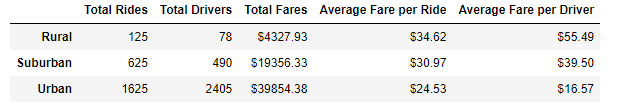
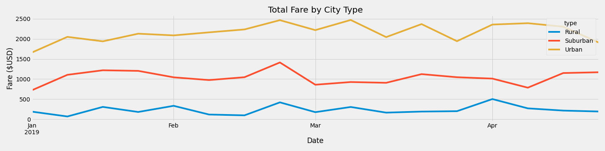

# PyBer Analysis

## Project Overview
Pyber, a ride sharing app company, has requested an analysis of all rideshare data from January 1, 2019 through early May of 2019.

## Purpose
Create a summary dataframe of the ride-sharing data by city type and then create a multiple line graph to illustrate the total weekly fares for each city type to determine how the data differs by city type.

## Resources
- Data Sources: [city_data.csv](Resources/city_data.csv), [ride_data.csv](Resources/ride_data.csv)
- Software: Python 3.7.10, Jupyter Notebook 6.3.0, Matplotlib 3.3.4

## Results

There are three categories of cities in the analysis: urban, suburban and rural. When reviewing the total number of rides, urban cities had the greatest demand with a total 1,625 rides.  Urban riders used Pyber more than suburban riders by almost 2.5 times as there were only 625 rider during the same time frame.  Unfortunately, the number of rural rides were drastically lower at only 125 total rides.  

With the greater ride usage in urban areas, it is reasonable that urban areas had significantly more drivers.  There were 2,405 drivers in urban areas.  That is 5 times the amount of drivers in the suburban areas which were 490.  These two areas comprised nearly 96% of the total drivers across the three city types.  There were only 78 rural drivers for Pybar, making up only about 3% of their total drivers. 

Clearly, almost all the fare revenue is generated in areas with larger populations.  Urban cities had the highest total dollar amount in fares, collecting almost $40,000.  This is double that of the suburban cities who collected fares totally just under $20,000.  Rural areas see a significant drop in the total amount of fares collected with less than $5,000.  

Rural riders pay an average of almost $35 per ride, which is about $10 more than the average fare for urban riders at almost $25.  Suburban riders pay almost $6 more than the urban ride at an average of approximately $31 per ride.  However, it is more lucrative for the rural driver who collects about an average of $55 per ride since, as revealed above, there are fewer rides in rural areas.  This is nearly 3.5 times more than the urban driver who collects about $16 per ride and about 1.4 times more than the suburban driver who collects an average of about $40 per ride, which is also 2.5 times more than the urban driver.  

In the "Total Fare by City Type" graph below, it supports the trends mentioned above.  The graph depicts the weekly fare totals by each city type from January 1, 2019 through April 28, 2019.  During those weeks, urban total weekly fares were as low as about $1600 in the beginning of January and continued to see a relatively steady increase until late February where the total fares peaked at $2500.  From there urban cities see a more ups and downs in the total fares week over week until the first week in April where we begin to see more of a plateau in the total fares.  As for suburban total fares by week, they are relatively stable after starting from a low of around $700 and maintaining between there and $1200 until we see a peak in late February of almost $1500.  Then there a drop in fares is experienced in the beginning of March and holds fairly constant before a drop again in 2nd week of April and then rebounding the following week.  The graph also displays the stark differences in the total fares collected in the rural cities.  The rural total fares see some ups and downs but they have a small peak in late February like the other city types before a slight drop in total fares and maintaining that until their highest peak in the beginning of April.  From there, total fares continue to decrease throughout the month.

## Summary
In conclusion, with the majority of the revenue coming from urban and suburban markets, these markets should continue to be a focus.  Unfortunately, it may be more difficult to attract drivers to these areas as the average fare per driver is significantly lower than those of rural drivers.  Therefore, it may be prudent to further examine how a change in rates may affect Pyber.  Raising rates slightly in urban cities might help attract drivers to the area if they begin making more per ride.  Also, it may be necessary to examine rural rates to determine if they are in line with the distances being traveled.  The higher rates in rural areas may be preventing riders from using Pybar.  In addition, it may be necessary to review the number of riders on each ride, as the amount per rider could impact the perceived cost by the rider.