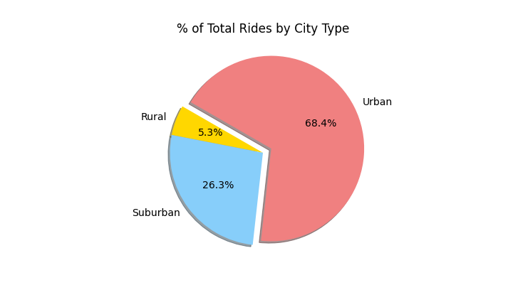

# PyBer Analysis

## Project Overview
Pyber, a ride sharing app company, has requested an analysis of all rideshare data from January to early May 2019.

## Purpose
Create a summary dataframe of the ride-sharing data by city type and then create a multiple line graph to illustrate the total weekly fares for each city type to determine how the data differs by city type.

## Resources
Data Sources: [city_data.csv](Resources/city_data.csv), [ride_data.csv](Resources/ride_data.csv)
Software: Python 3.7.10, Jupyter Notebook 6.3.0, 

## Results
description in ride sharing data among the different city types.  ride sharing data include the total rides, total drivers, total fares, average fare per ride and driver and total fare by city type

There are three categories of cities in the analysis: urban, suburban and rural. When reviewing the total number of rides, urban cities had the greatest percentage of rides by far with 68.4% of rides taking place in an urban city.  In comparision, rides in rural cities comprised only 5.3% of the total rides in the time period reviewed.

Once again with respect to the total drivers in each city type, urban cities had the clear majority.  Nearly 80% of the total drivers were in urban cities, followed by approximately 16% were in suburban cities and only 3% in rural cities.  

Nearly 63% of the total fares received by Pybar were in urban cities and about 31% in suburban cities.  Clearly, almost all the fare revenue is generated in larger populations.  Rural cities only contributed about 7% of the total fares collected.

## Summary
ther eis a statement summarzing 3 business recommendations to the ceo for addressing any disparities among the city types.